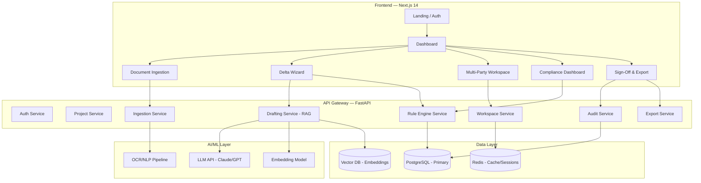

# ClauseProof — Implementation Blueprint

## 🎯 Mission Statement
**Compliance-as-Code**: Every disclosure is sourced, tested, versioned, and signed off with deterministic validation. ClauseProof transforms SME IPO document preparation from an opaque, intermediary-heavy process into a transparent, auditable, and accessible compliance operating system.

---

## 📐 System Architecture



---

## 🏗️ Technology Stack

| Layer | Technology | Justification |
|-------|-----------|---------------|
| **Frontend** | Next.js 14 + TailwindCSS v4 | SSR/SSG, App Router, optimal SEO |
| **Backend** | Python FastAPI | Async, type-safe, auto-docs, fast |
| **Primary DB** | PostgreSQL 16 | ACID compliance, JSON support, regulatory data integrity |
| **Cache/RT** | Redis | WebSocket pub/sub, session cache |
| **Vector Store** | ChromaDB / pgvector | RAG retrieval for clause bank |
| **LLM** | Claude API / OpenAI API | RAG drafting agent |
| **OCR** | Tesseract + pdfplumber | Document data extraction |
| **Auth** | JWT + RBAC | Role-based multi-party access |
| **Deployment** | Docker + Docker Compose | Consistent environments |

---

## 📊 Database Schema Design

### Core Tables

```sql
-- Projects (IPO Filing)
CREATE TABLE projects (
    id UUID PRIMARY KEY DEFAULT gen_random_uuid(),
    name VARCHAR(255) NOT NULL,
    company_name VARCHAR(255) NOT NULL,
    cin VARCHAR(21),  -- Corporate Identity Number
    incorporation_date DATE,
    status VARCHAR(50) DEFAULT 'draft',  -- draft, review, approved, filed
    created_by UUID REFERENCES users(id),
    created_at TIMESTAMPTZ DEFAULT NOW(),
    updated_at TIMESTAMPTZ DEFAULT NOW()
);

-- DRHP Sections (Schedule VI mapped)
CREATE TABLE drhp_sections (
    id UUID PRIMARY KEY DEFAULT gen_random_uuid(),
    project_id UUID REFERENCES projects(id),
    section_code VARCHAR(20) NOT NULL,  -- e.g., 'COVER', 'RISK', 'BIZ_OVERVIEW'
    section_name VARCHAR(255) NOT NULL,
    parent_section_id UUID REFERENCES drhp_sections(id),
    content JSONB,  -- Structured disclosure data
    ai_draft TEXT,
    human_edited TEXT,
    compliance_status VARCHAR(20) DEFAULT 'pending',
    version INTEGER DEFAULT 1,
    updated_at TIMESTAMPTZ DEFAULT NOW()
);

-- Regulatory Rules (ICDR)
CREATE TABLE regulatory_rules (
    id UUID PRIMARY KEY DEFAULT gen_random_uuid(),
    rule_code VARCHAR(50) UNIQUE NOT NULL,
    regulation VARCHAR(100) NOT NULL,  -- 'ICDR_2018', 'ICDR_2025_AMD'
    chapter VARCHAR(50),
    section_ref VARCHAR(100),
    rule_text TEXT NOT NULL,
    validation_logic JSONB NOT NULL,  -- Deterministic rule definition
    severity VARCHAR(20) DEFAULT 'mandatory',
    applicable_to VARCHAR(50) DEFAULT 'sme',
    effective_from DATE,
    superseded_by UUID REFERENCES regulatory_rules(id),
    created_at TIMESTAMPTZ DEFAULT NOW()
);

-- Compliance Results
CREATE TABLE compliance_results (
    id UUID PRIMARY KEY DEFAULT gen_random_uuid(),
    project_id UUID REFERENCES projects(id),
    section_id UUID REFERENCES drhp_sections(id),
    rule_id UUID REFERENCES regulatory_rules(id),
    status VARCHAR(20) NOT NULL,  -- 'pass', 'fail', 'warning', 'na'
    message TEXT,
    evidence JSONB,
    checked_at TIMESTAMPTZ DEFAULT NOW()
);

-- Hash-Chained Audit Log (Tamper-Evident)
CREATE TABLE audit_log (
    id BIGSERIAL PRIMARY KEY,
    project_id UUID REFERENCES projects(id),
    actor_id UUID REFERENCES users(id),
    action VARCHAR(100) NOT NULL,
    entity_type VARCHAR(50),
    entity_id UUID,
    details JSONB,
    content_hash VARCHAR(64) NOT NULL,  -- SHA-256 of action data
    previous_hash VARCHAR(64) NOT NULL,  -- Chain link
    timestamp TIMESTAMPTZ DEFAULT NOW()
);

-- Users & Roles
CREATE TABLE users (
    id UUID PRIMARY KEY DEFAULT gen_random_uuid(),
    email VARCHAR(255) UNIQUE NOT NULL,
    name VARCHAR(255) NOT NULL,
    password_hash VARCHAR(255) NOT NULL,
    role VARCHAR(50) NOT NULL,  -- 'promoter', 'merchant_banker', 'legal_counsel', 'compliance_officer', 'admin'
    organization VARCHAR(255),
    created_at TIMESTAMPTZ DEFAULT NOW()
);

-- Sign-Offs
CREATE TABLE sign_offs (
    id UUID PRIMARY KEY DEFAULT gen_random_uuid(),
    project_id UUID REFERENCES projects(id),
    section_id UUID REFERENCES drhp_sections(id),
    signer_id UUID REFERENCES users(id),
    signer_role VARCHAR(50) NOT NULL,
    status VARCHAR(20) NOT NULL,  -- 'approved', 'rejected', 'pending'
    comments TEXT,
    digital_signature TEXT,
    signed_at TIMESTAMPTZ
);
```

---

## 🔧 Rule Engine Design

### Rule Definition Format (JSON Schema)
```json
{
    "rule_code": "ICDR_CH9_PROFIT",
    "description": "Positive EBITDA in at least 2 of 3 preceding FYs",
    "section_ref": "Chapter IX, Reg 229",
    "validation": {
        "type": "financial_threshold",
        "field": "ebitda",
        "condition": "count_positive_years >= 2",
        "lookback_years": 3,
        "data_source": "financial_statements"
    },
    "severity": "mandatory",
    "failure_message": "Company must show positive operating profit (EBITDA) in at least 2 of the 3 preceding financial years"
}
```

### Rule Categories
1. **Eligibility Rules** — Paid-up capital, profitability, track record
2. **Disclosure Completeness** — All Schedule VI sections present
3. **Financial Validation** — Cross-referencing financial data
4. **Structural Rules** — Document format, ordering, mandatory headers
5. **Cross-Reference Rules** — Internal consistency checks

---

## 🚀 Hackathon MVP Scope

### Phase 1: Core Platform (Building Now)
1. ✅ Project setup (Next.js + FastAPI + PostgreSQL)
2. ✅ Authentication & RBAC
3. ✅ Project creation & management
4. ✅ DRHP section-by-section editor (Delta Wizard)
5. ✅ Deterministic rule engine with 30+ ICDR rules
6. ✅ Real-time compliance dashboard
7. ✅ Hash-chained audit trail
8. ✅ Multi-party workspace (role-based views)
9. ✅ Document export (PDF/DOCX)
10. ✅ Beautiful, production-quality UI

### Deferred to Alpha
- OCR/NLP document ingestion
- Full RAG drafting agent
- WebSocket real-time collaboration
- Neo4j regulatory graph
- Kubernetes deployment

---

## 📁 Project Structure

```
ClauseProof/
├── frontend/                  # Next.js 14 Application
│   ├── app/                   # App Router pages
│   │   ├── (auth)/           # Auth pages
│   │   ├── dashboard/        # Main dashboard
│   │   ├── projects/         # Project management
│   │   │   └── [id]/        # Individual project
│   │   │       ├── editor/  # Delta Wizard
│   │   │       ├── compliance/ # Compliance dashboard
│   │   │       └── workspace/  # Multi-party workspace
│   │   └── layout.tsx        # Root layout
│   ├── components/           # Reusable UI components
│   ├── lib/                  # Utilities, API client
│   └── styles/               # Global styles
│
├── backend/                   # FastAPI Application
│   ├── app/
│   │   ├── api/              # API routes
│   │   │   ├── auth.py
│   │   │   ├── projects.py
│   │   │   ├── sections.py
│   │   │   ├── compliance.py
│   │   │   ├── audit.py
│   │   │   └── workspace.py
│   │   ├── core/             # Core business logic
│   │   │   ├── rule_engine.py
│   │   │   ├── audit_chain.py
│   │   │   └── security.py
│   │   ├── models/           # SQLAlchemy models
│   │   ├── schemas/          # Pydantic schemas
│   │   ├── services/         # Business logic services
│   │   └── main.py           # FastAPI app entry
│   ├── rules/                # ICDR rule definitions (JSON)
│   ├── migrations/           # Alembic migrations
│   └── requirements.txt
│
├── docker-compose.yml         # Full stack orchestration
└── README.md
```
